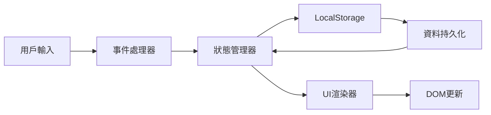

# 🌲 靜謐森林 Soul Barn - 技術規格文件與系統架構書

> **版本**: v3.0.0  
> **文件類型**: Technical Specification & System Architecture  
> **更新日期**: 2025-09-03  
> **文件狀態**: Complete  
> **作者**: System Architecture Team

---

## 📑 執行摘要 (Executive Summary)

### 專案概述
靜謐森林 Soul Barn 是一個創新的數位療癒平台，結合心理測驗、21天個人成長旅程與社群互動功能。本系統採用純前端架構，實現高效能、可擴展的用戶體驗。

### 技術亮點
- **零後端依賴**: 純前端實現，降低維護成本
- **漸進式載入**: 模組化架構，按需載入內容
- **本地化存儲**: 完整的離線體驗支援
- **響應式設計**: 全裝置適配的視覺體驗
- **高效能優化**: 達成 Core Web Vitals 標準

### 關鍵指標
- 首次內容繪製 (FCP): < 1.8秒
- 最大內容繪製 (LCP): < 2.5秒
- 首次輸入延遲 (FID): < 100毫秒
- 累積版面位移 (CLS): < 0.1

---

## 🏛️ 系統架構總覽

### 架構模式
```
┌─────────────────────────────────────────────────────────────┐
│                        用戶介面層 (UI Layer)                  │
│  ┌──────────┐  ┌──────────┐  ┌──────────┐  ┌──────────┐   │
│  │Landing   │  │Test      │  │Result    │  │Journey   │   │
│  │Page      │→ │Engine    │→ │Display   │→ │Framework │   │
│  └──────────┘  └──────────┘  └──────────┘  └──────────┘   │
└─────────────────────────────────────────────────────────────┘
                              ↓
┌─────────────────────────────────────────────────────────────┐
│                     業務邏輯層 (Business Logic)               │
│  ┌──────────┐  ┌──────────┐  ┌──────────┐  ┌──────────┐   │
│  │Progress  │  │Content   │  │Storage   │  │Auth      │   │
│  │Manager   │  │Loader    │  │Manager   │  │Manager   │   │
│  └──────────┘  └──────────┘  └──────────┘  └──────────┘   │
└─────────────────────────────────────────────────────────────┘
                              ↓
┌─────────────────────────────────────────────────────────────┐
│                      資料存儲層 (Data Layer)                  │
│  ┌──────────────────────────────────────────────────────┐  │
│  │                    LocalStorage API                   │  │
│  │  ├─ forest_user (用戶資料)                           │  │
│  │  ├─ forest_progress (進度追蹤)                       │  │
│  │  ├─ forest_journal_day_X (日誌記錄)                  │  │
│  │  └─ forest_preferences (用戶偏好)                    │  │
│  └──────────────────────────────────────────────────────┘  │
└─────────────────────────────────────────────────────────────┘
```

### 資料流架構


---

## 🔧 核心技術棧

### 前端框架與工具

| 技術類別 | 採用技術 | 版本 | 用途說明 |
|---------|---------|------|---------|
| **標記語言** | HTML5 | 5.2 | 語義化結構，SEO優化 |
| **樣式框架** | Tailwind CSS | 3.4.x | 原子化CSS，快速開發 |
| **程式語言** | JavaScript | ES6+ | 業務邏輯實現 |
| **資料視覺化** | Chart.js | 4.4.x | 測驗結果圖表呈現 |
| **本地存儲** | LocalStorage | Web API | 用戶資料持久化 |
| **版本控制** | Git | 2.40+ | 程式碼版本管理 |
| **開發環境** | VS Code | Latest | 主要開發工具 |

### CDN 依賴項

```html
<!-- Tailwind CSS -->
<script src="https://cdn.tailwindcss.com"></script>

<!-- Chart.js -->
<script src="https://cdn.jsdelivr.net/npm/chart.js@4.4.0/dist/chart.umd.min.js"></script>

<!-- Google Fonts -->
<link href="https://fonts.googleapis.com/css2?family=Inter:wght@400;500;600;700&family=Noto+Sans+TC:wght@400;500;700&display=swap" rel="stylesheet">
```

---

## 📦 模組化系統設計

### 核心模組架構

#### 1. 進度管理器 (ProgressManager)
```javascript
class ProgressManager {
  constructor(config) {
    this.config = {
      storageKey: 'forest_progress',
      totalDays: 21,
      enableDailyUnlock: false,
      startDate: null
    };
    this.progress = {
      current: 1,
      completed: [],
      lastActivity: null,
      startDate: null
    };
  }
  
  // 核心方法
  getCurrentDay() { /* 獲取當前日期 */ }
  setCurrentDay(day) { /* 設定當前日期 */ }
  markDayCompleted(day) { /* 標記完成 */ }
  isDayUnlocked(day) { /* 檢查解鎖狀態 */ }
  getCompletionRate() { /* 計算完成率 */ }
}
```

#### 2. 內容載入器 (ContentLoader)
```javascript
class ContentLoader {
  constructor(config) {
    this.config = {
      basePath: './21-day-journey/',
      cacheEnabled: true,
      timeout: 5000
    };
    this.cache = new Map();
  }
  
  // 核心方法
  async loadDayContent(day) { /* 載入每日內容 */ }
  async preloadContent(days) { /* 預載入內容 */ }
  clearCache() { /* 清除快取 */ }
  handleFallback(day, error) { /* 錯誤處理 */ }
}
```

#### 3. 存儲管理器 (StorageManager)
```javascript
class StorageManager {
  constructor(prefix = 'forest_') {
    this.prefix = prefix;
    this.quota = this.checkStorageQuota();
  }
  
  // 核心方法
  set(key, value) { /* 儲存資料 */ }
  get(key) { /* 讀取資料 */ }
  remove(key) { /* 刪除資料 */ }
  clear() { /* 清空所有資料 */ }
  export() { /* 匯出資料 */ }
  import(data) { /* 匯入資料 */ }
}
```

#### 4. 認證管理器 (AuthManager)
```javascript
class AuthManager {
  constructor() {
    this.user = null;
    this.animal = null;
    this.permissions = new Set();
  }
  
  // 核心方法
  initUser(testResults) { /* 初始化用戶 */ }
  mapToAnimal(scores) { /* 映射動物角色 */ }
  checkAccess(resource) { /* 檢查訪問權限 */ }
  updateUserState(state) { /* 更新用戶狀態 */ }
}
```

---

## 🎯 頁面架構詳解

### 使用者流程圖
```
┌──────────────┐     ┌──────────────┐     ┌──────────────┐
│              │     │              │     │              │
│  Landing     │────▶│  Psychology  │────▶│   Result     │
│    Page      │     │     Test     │     │   Display    │
│(v7_gemini)   │     │  (embedded)  │     │ (index.html) │
│              │     │              │     │              │
└──────────────┘     └──────────────┘     └──────────────┘
                                                  │
                                                  ▼
                                          ┌──────────────┐
                                          │              │
                                          │     LINE     │
                                          │  Integration │
                                          │              │
                                          └──────────────┘
                                                  │
                                                  ▼
                                          ┌──────────────┐
                                          │              │
                                          │   21-Day     │
                                          │   Journey    │
                                          │(forest-      │
                                          │ journey.html)│
                                          └──────────────┘
```

### 頁面技術規格

#### 1. Landing Page (v7_gemini.html)
| 屬性 | 規格 |
|------|------|
| **檔案大小** | ~75KB |
| **載入時間** | < 1.5s |
| **互動元素** | 15+ |
| **響應斷點** | 640px, 768px, 1024px, 1280px |
| **動畫效果** | CSS Transitions, Smooth Scroll |
| **SEO優化** | Meta Tags, Structured Data |

#### 2. 測驗結果頁 (index.html)
| 屬性 | 規格 |
|------|------|
| **檔案大小** | ~46KB |
| **資料處理** | Client-side Calculation |
| **圖表渲染** | Chart.js Radar Chart |
| **個人化內容** | 32種動物角色 |
| **社交功能** | LINE QR Code Integration |

#### 3. 21天旅程框架 (forest-journey.html)
| 屬性 | 規格 |
|------|------|
| **檔案大小** | ~20KB (不含內容) |
| **內容載入** | Dynamic AJAX |
| **環境檢測** | Protocol Detection |
| **錯誤處理** | Graceful Fallback |
| **進度追蹤** | LocalStorage Based |

---

## 🗄️ 資料結構設計

### LocalStorage Schema

#### 1. 用戶資料 (forest_user)
```typescript
interface ForestUser {
  id: string;                    // UUID v4
  createdAt: number;             // Unix timestamp
  animal: {
    type: string;                // 動物類型 ID
    name: string;                // 動物名稱
    characteristics: string[];   // 特徵陣列
  };
  testResults: {
    openness: number;            // 0-100
    conscientiousness: number;   // 0-100
    extraversion: number;        // 0-100
    agreeableness: number;       // 0-100
    neuroticism: number;         // 0-100
  };
  preferences: {
    language: string;            // zh-TW, en-US
    theme: string;              // light, dark, auto
    notifications: boolean;
  };
}
```

#### 2. 進度追蹤 (forest_progress)
```typescript
interface ForestProgress {
  current: number;               // 當前選中的日期
  completed: number[];           // 已完成的日期陣列
  lastActivity: number;          // 最後活動時間
  startDate: number | null;      // 旅程開始日期
  milestones: {
    firstWeek: boolean;         // 第一週完成
    secondWeek: boolean;        // 第二週完成
    thirdWeek: boolean;         // 第三週完成
    journey: boolean;           // 全程完成
  };
  statistics: {
    totalTime: number;          // 總使用時間 (秒)
    averageTime: number;        // 平均每日時間
    streakDays: number;         // 連續天數
    longestStreak: number;      // 最長連續記錄
  };
}
```

#### 3. 日誌記錄 (forest_journal_day_X)
```typescript
interface ForestJournal {
  day: number;                  // 日期編號
  content: {
    morning: string;            // 晨間反思
    evening: string;            // 夜間回顧
    gratitude: string[];        // 感恩清單
    insights: string;           // 洞察記錄
  };
  mood: {
    morning: string;            // 晨間心情 (emoji)
    evening: string;            // 夜間心情 (emoji)
    energy: number;             // 能量等級 (1-5)
  };
  savedAt: number;              // 儲存時間
  editHistory: Array<{
    timestamp: number;
    content: string;
  }>;
}
```

---

## 🎨 設計系統規範

### 顏色系統

#### 主要色彩
```scss
// 品牌主色
$forest-green: #2E4F4F;        // HSL(180, 26%, 24%)
$forest-cta: #C87D54;           // HSL(20, 48%, 56%)
$forest-cta-dark: #B56A40;      // HSL(20, 48%, 48%)

// 背景色
$forest-bg: #F9F7F3;            // HSL(40, 29%, 96%)
$forest-card-bg: #FFFFFF;       // HSL(0, 0%, 100%)
$forest-highlight: #E4EFE7;     // HSL(138, 28%, 91%)

// 文字色
$forest-text-dark: #3A3A3A;    // HSL(0, 0%, 23%)
$forest-text-light: #6B6B6B;   // HSL(0, 0%, 42%)

// 邊框色
$forest-border: #EAE5E0;        // HSL(30, 15%, 89%)

// 狀態色
$success: #4ADE80;              // 成功
$warning: #FBBF24;              // 警告
$error: #F87171;                // 錯誤
$info: #60A5FA;                 // 資訊
```

### 字型系統

#### 字型配置
```css
/* 字型堆疊 */
--font-sans: 'Inter', 'Noto Sans TC', system-ui, -apple-system, sans-serif;
--font-mono: 'Fira Code', 'JetBrains Mono', monospace;

/* 字級規範 (基準: 16px) */
--text-xs: 0.75rem;      /* 12px */
--text-sm: 0.875rem;     /* 14px */
--text-base: 1rem;       /* 16px */
--text-lg: 1.125rem;     /* 18px */
--text-xl: 1.25rem;      /* 20px */
--text-2xl: 1.5rem;      /* 24px */
--text-3xl: 1.875rem;    /* 30px */
--text-4xl: 2.25rem;     /* 36px */
--text-5xl: 3rem;        /* 48px */

/* 字重 */
--font-normal: 400;
--font-medium: 500;
--font-semibold: 600;
--font-bold: 700;

/* 行高 */
--leading-tight: 1.25;
--leading-normal: 1.5;
--leading-relaxed: 1.75;
--leading-loose: 2;
```

### 間距系統

#### 8px 網格系統
```css
/* 間距規範 */
--space-0: 0;           /* 0px */
--space-1: 0.25rem;     /* 4px */
--space-2: 0.5rem;      /* 8px */
--space-3: 0.75rem;     /* 12px */
--space-4: 1rem;        /* 16px */
--space-5: 1.25rem;     /* 20px */
--space-6: 1.5rem;      /* 24px */
--space-8: 2rem;        /* 32px */
--space-10: 2.5rem;     /* 40px */
--space-12: 3rem;       /* 48px */
--space-16: 4rem;       /* 64px */
--space-20: 5rem;       /* 80px */
--space-24: 6rem;       /* 96px */
```

### 組件系統

#### 按鈕組件
```css
/* 基礎按鈕 */
.btn {
  @apply px-6 py-3 rounded-lg font-medium transition-all duration-200;
  @apply focus:outline-none focus:ring-2 focus:ring-offset-2;
}

/* 主要按鈕 */
.btn-primary {
  @apply bg-forest-green text-white;
  @apply hover:bg-opacity-90 focus:ring-forest-green;
}

/* CTA 按鈕 */
.btn-cta {
  @apply bg-forest-cta text-white px-8 py-4 rounded-xl shadow-lg;
  @apply hover:bg-forest-cta-dark hover:shadow-xl;
  @apply transform hover:-translate-y-0.5;
}

/* 次要按鈕 */
.btn-secondary {
  @apply bg-white text-forest-text-dark border border-forest-border;
  @apply hover:bg-forest-bg;
}

/* 幽靈按鈕 */
.btn-ghost {
  @apply text-forest-text-light;
  @apply hover:text-forest-text-dark hover:bg-forest-bg;
}
```

#### 卡片組件
```css
/* 基礎卡片 */
.card {
  @apply bg-white rounded-xl p-6;
  @apply border border-forest-border;
  @apply shadow-soft;
}

/* 互動卡片 */
.card-interactive {
  @apply card cursor-pointer transition-all duration-200;
  @apply hover:shadow-lg hover:-translate-y-1;
}

/* 高亮卡片 */
.card-highlight {
  @apply card bg-forest-highlight/50;
  @apply border-forest-green/20;
}
```

---

## 🚀 效能優化策略

### Core Web Vitals 優化

#### 1. 首次內容繪製 (FCP) 優化
```javascript
// Critical CSS 內聯
const criticalCSS = `
  body { margin: 0; font-family: sans-serif; }
  .container { max-width: 1280px; margin: 0 auto; }
  /* 首屏關鍵樣式 */
`;

// 預連接關鍵資源
<link rel="preconnect" href="https://fonts.googleapis.com">
<link rel="preconnect" href="https://cdn.jsdelivr.net">

// DNS 預解析
<link rel="dns-prefetch" href="https://cdn.tailwindcss.com">
```

#### 2. 最大內容繪製 (LCP) 優化
```javascript
// 圖片優化策略
const imageOptimization = {
  // 延遲載入
  lazyLoading: true,
  
  // 響應式圖片
  responsiveImages: {
    srcset: [
      'image-320w.jpg 320w',
      'image-640w.jpg 640w',
      'image-1280w.jpg 1280w'
    ],
    sizes: '(max-width: 640px) 100vw, (max-width: 1024px) 50vw, 33vw'
  },
  
  // WebP 格式支援
  modernFormats: ['webp', 'avif'],
  
  // 預載入關鍵圖片
  preloadHero: true
};
```

#### 3. 首次輸入延遲 (FID) 優化
```javascript
// 程式碼分割
const loadModule = async (moduleName) => {
  const module = await import(`./modules/${moduleName}.js`);
  return module.default;
};

// 延遲非關鍵 JavaScript
const deferNonCritical = () => {
  requestIdleCallback(() => {
    // 載入分析腳本
    loadAnalytics();
    // 載入社交分享
    loadSocialWidgets();
  });
};

// Web Worker 處理繁重計算
const worker = new Worker('calculator.worker.js');
worker.postMessage({ type: 'CALCULATE_RESULTS', data: testAnswers });
```

#### 4. 累積版面位移 (CLS) 優化
```css
/* 預設尺寸 */
.image-container {
  aspect-ratio: 16 / 9;
  width: 100%;
  background: #f0f0f0;
}

/* 字型載入優化 */
@font-face {
  font-family: 'Inter';
  font-display: swap; /* 避免 FOIT */
  src: url('/fonts/inter.woff2') format('woff2');
}

/* 骨架屏 */
.skeleton {
  animation: skeleton-loading 1.5s infinite;
  background: linear-gradient(90deg, #f0f0f0 25%, #e0e0e0 50%, #f0f0f0 75%);
}
```

### 資源優化

#### 1. 打包優化配置
```javascript
// webpack.config.js
module.exports = {
  optimization: {
    splitChunks: {
      chunks: 'all',
      cacheGroups: {
        vendor: {
          test: /[\\/]node_modules[\\/]/,
          name: 'vendors',
          priority: 10
        },
        common: {
          minChunks: 2,
          priority: 5,
          reuseExistingChunk: true
        }
      }
    },
    minimize: true,
    minimizer: [
      new TerserPlugin({
        terserOptions: {
          compress: {
            drop_console: true,
            drop_debugger: true
          }
        }
      }),
      new CssMinimizerPlugin()
    ]
  }
};
```

#### 2. 快取策略
```javascript
// Service Worker 快取策略
const cacheStrategies = {
  // 靜態資源 - Cache First
  static: {
    pattern: /\.(js|css|woff2?)$/,
    strategy: 'CacheFirst',
    cacheName: 'static-v1',
    expiration: {
      maxEntries: 60,
      maxAgeSeconds: 7 * 24 * 60 * 60 // 7天
    }
  },
  
  // 圖片資源 - Cache First
  images: {
    pattern: /\.(png|jpg|jpeg|webp|svg)$/,
    strategy: 'CacheFirst',
    cacheName: 'images-v1',
    expiration: {
      maxEntries: 100,
      maxAgeSeconds: 30 * 24 * 60 * 60 // 30天
    }
  },
  
  // HTML 內容 - Network First
  documents: {
    pattern: /\.html$/,
    strategy: 'NetworkFirst',
    cacheName: 'documents-v1',
    networkTimeoutSeconds: 3
  },
  
  // API 請求 - Network First
  api: {
    pattern: /\/api\//,
    strategy: 'NetworkFirst',
    cacheName: 'api-v1',
    networkTimeoutSeconds: 5,
    expiration: {
      maxEntries: 50,
      maxAgeSeconds: 5 * 60 // 5分鐘
    }
  }
};
```

---

## 🔒 安全性設計

### 前端安全措施

#### 1. XSS 防護
```javascript
// 輸入清理
const sanitizeInput = (input) => {
  const div = document.createElement('div');
  div.textContent = input;
  return div.innerHTML;
};

// Content Security Policy
<meta http-equiv="Content-Security-Policy" 
      content="default-src 'self'; 
               script-src 'self' 'unsafe-inline' https://cdn.tailwindcss.com; 
               style-src 'self' 'unsafe-inline' https://fonts.googleapis.com;">
```

#### 2. 資料驗證
```javascript
// 客戶端驗證
const validateTestResults = (results) => {
  const schema = {
    openness: { min: 0, max: 100, type: 'number' },
    conscientiousness: { min: 0, max: 100, type: 'number' },
    extraversion: { min: 0, max: 100, type: 'number' },
    agreeableness: { min: 0, max: 100, type: 'number' },
    neuroticism: { min: 0, max: 100, type: 'number' }
  };
  
  for (const [key, rules] of Object.entries(schema)) {
    const value = results[key];
    if (typeof value !== rules.type || 
        value < rules.min || 
        value > rules.max) {
      throw new ValidationError(`Invalid ${key}: ${value}`);
    }
  }
  return true;
};
```

#### 3. 隱私保護
```javascript
// 資料加密存儲
class SecureStorage {
  encrypt(data) {
    // 使用 Web Crypto API
    return window.crypto.subtle.encrypt(
      { name: "AES-GCM", iv: this.iv },
      this.key,
      new TextEncoder().encode(JSON.stringify(data))
    );
  }
  
  decrypt(encryptedData) {
    return window.crypto.subtle.decrypt(
      { name: "AES-GCM", iv: this.iv },
      this.key,
      encryptedData
    );
  }
}

// 敏感資料遮罩
const maskSensitiveData = (data) => {
  return {
    ...data,
    email: data.email?.replace(/(.{2})(.*)(@.*)/, '$1***$3'),
    phone: data.phone?.replace(/(\d{3})\d{4}(\d{4})/, '$1****$2')
  };
};
```

---

## 📊 監控與分析

### 效能監控

#### 1. 自定義效能指標
```javascript
// 效能監控類
class PerformanceMonitor {
  constructor() {
    this.metrics = {};
    this.observer = new PerformanceObserver((list) => {
      for (const entry of list.getEntries()) {
        this.processEntry(entry);
      }
    });
  }
  
  // 監控頁面載入
  trackPageLoad() {
    this.metrics.pageLoad = {
      domContentLoaded: performance.timing.domContentLoadedEventEnd - 
                        performance.timing.navigationStart,
      loadComplete: performance.timing.loadEventEnd - 
                   performance.timing.navigationStart,
      firstPaint: performance.getEntriesByType('paint')[0]?.startTime,
      firstContentfulPaint: performance.getEntriesByType('paint')[1]?.startTime
    };
  }
  
  // 監控用戶互動
  trackInteraction(name, startTime) {
    const duration = performance.now() - startTime;
    this.metrics.interactions = this.metrics.interactions || [];
    this.metrics.interactions.push({ name, duration, timestamp: Date.now() });
  }
  
  // 發送分析資料
  sendAnalytics() {
    if (navigator.sendBeacon) {
      navigator.sendBeacon('/analytics', JSON.stringify(this.metrics));
    }
  }
}
```

#### 2. 錯誤追蹤
```javascript
// 全域錯誤處理
window.addEventListener('error', (event) => {
  const errorInfo = {
    message: event.message,
    source: event.filename,
    line: event.lineno,
    column: event.colno,
    stack: event.error?.stack,
    userAgent: navigator.userAgent,
    timestamp: new Date().toISOString(),
    url: window.location.href
  };
  
  // 發送錯誤報告
  console.error('Application Error:', errorInfo);
  // 可整合 Sentry 等錯誤追蹤服務
});

// Promise 錯誤處理
window.addEventListener('unhandledrejection', (event) => {
  console.error('Unhandled Promise Rejection:', event.reason);
});
```

---

## 🚢 部署策略

### 環境配置

#### 1. 開發環境
```yaml
# docker-compose.dev.yml
version: '3.8'
services:
  web:
    image: nginx:alpine
    volumes:
      - ./:/usr/share/nginx/html
    ports:
      - "8000:80"
    environment:
      - NODE_ENV=development
```

#### 2. 測試環境
```yaml
# .github/workflows/test.yml
name: Test
on: [push, pull_request]
jobs:
  test:
    runs-on: ubuntu-latest
    steps:
      - uses: actions/checkout@v2
      - name: Run Tests
        run: |
          npm install
          npm test
      - name: Lighthouse CI
        uses: treosh/lighthouse-ci-action@v8
        with:
          urls: |
            http://localhost:8000
          uploadArtifacts: true
```

#### 3. 生產環境
```nginx
# nginx.conf
server {
    listen 80;
    server_name soulbarn.com;
    
    # 開啟 Gzip
    gzip on;
    gzip_types text/css application/javascript application/json;
    
    # 快取策略
    location ~* \.(jpg|jpeg|png|gif|ico|css|js)$ {
        expires 30d;
        add_header Cache-Control "public, immutable";
    }
    
    # SPA 路由
    location / {
        try_files $uri $uri/ /index.html;
    }
    
    # 安全標頭
    add_header X-Frame-Options "SAMEORIGIN";
    add_header X-Content-Type-Options "nosniff";
    add_header X-XSS-Protection "1; mode=block";
}
```

### CI/CD Pipeline

```yaml
# .github/workflows/deploy.yml
name: Deploy
on:
  push:
    branches: [main]

jobs:
  build-and-deploy:
    runs-on: ubuntu-latest
    steps:
      - uses: actions/checkout@v2
      
      - name: Setup Node
        uses: actions/setup-node@v2
        with:
          node-version: '18'
          
      - name: Install Dependencies
        run: npm ci
        
      - name: Build
        run: npm run build
        env:
          NODE_ENV: production
          
      - name: Optimize Images
        run: |
          npm install -g imagemin-cli
          imagemin media/image/**/* --out-dir=dist/media/image
          
      - name: Deploy to Netlify
        uses: netlify/actions/cli@master
        with:
          args: deploy --prod --dir=dist
        env:
          NETLIFY_AUTH_TOKEN: ${{ secrets.NETLIFY_AUTH_TOKEN }}
          NETLIFY_SITE_ID: ${{ secrets.NETLIFY_SITE_ID }}
```

---

## 🧪 測試策略

### 測試架構

#### 1. 單元測試
```javascript
// progress-manager.test.js
describe('ProgressManager', () => {
  let progressManager;
  
  beforeEach(() => {
    localStorage.clear();
    progressManager = new ProgressManager();
  });
  
  test('should initialize with day 1', () => {
    expect(progressManager.getCurrentDay()).toBe(1);
  });
  
  test('should mark day as completed', () => {
    progressManager.markDayCompleted(1);
    expect(progressManager.isDayCompleted(1)).toBe(true);
  });
  
  test('should calculate completion rate', () => {
    progressManager.markDayCompleted(1);
    progressManager.markDayCompleted(2);
    expect(progressManager.getCompletionRate()).toBeCloseTo(9.52, 2);
  });
});
```

#### 2. 整合測試
```javascript
// journey-flow.test.js
describe('Journey Flow Integration', () => {
  test('complete user journey', async () => {
    // 1. 載入首頁
    await page.goto('http://localhost:8000');
    
    // 2. 開始測驗
    await page.click('[data-test="start-test"]');
    
    // 3. 完成測驗
    for (let i = 0; i < 20; i++) {
      await page.click('[data-test="answer-3"]');
      await page.click('[data-test="next-question"]');
    }
    
    // 4. 查看結果
    await expect(page).toHaveSelector('[data-test="result-display"]');
    
    // 5. 進入旅程
    await page.click('[data-test="start-journey"]');
    await expect(page).toHaveURL(/.*forest-journey\.html/);
  });
});
```

#### 3. E2E 測試
```javascript
// cypress/integration/journey.spec.js
describe('21-Day Journey E2E', () => {
  it('should complete day 1 activities', () => {
    cy.visit('/forest-journey.html');
    
    // 檢查地圖渲染
    cy.get('#journey-map').should('be.visible');
    
    // 點擊 Day 1
    cy.get('[data-day="1"]').click();
    
    // 檢查內容載入
    cy.get('#day-content').should('contain', 'Day 1');
    
    // 填寫日誌
    cy.get('[data-journal]').type('Today I started my journey...');
    cy.get('[data-save]').click();
    
    // 驗證儲存
    cy.get('[data-success]').should('be.visible');
  });
});
```

---

## 📈 擴展性設計

### 微服務架構準備

```javascript
// 未來後端整合介面
class APIAdapter {
  constructor(config) {
    this.baseURL = config.baseURL || 'https://api.soulbarn.com';
    this.version = config.version || 'v1';
    this.offline = config.offline || true;
  }
  
  async request(endpoint, options = {}) {
    // 檢查線上狀態
    if (!navigator.onLine && this.offline) {
      return this.offlineHandler(endpoint, options);
    }
    
    try {
      const response = await fetch(`${this.baseURL}/${this.version}/${endpoint}`, {
        ...options,
        headers: {
          'Content-Type': 'application/json',
          ...options.headers
        }
      });
      
      return await response.json();
    } catch (error) {
      return this.errorHandler(error);
    }
  }
  
  // 離線處理
  offlineHandler(endpoint, options) {
    // 使用 LocalStorage 作為後備
    const cache = new StorageManager();
    return cache.get(`api_${endpoint}`);
  }
}
```

### 插件系統

```javascript
// 插件架構
class PluginSystem {
  constructor() {
    this.plugins = new Map();
    this.hooks = new Map();
  }
  
  // 註冊插件
  register(name, plugin) {
    if (typeof plugin.install !== 'function') {
      throw new Error('Plugin must have an install method');
    }
    
    this.plugins.set(name, plugin);
    plugin.install(this);
  }
  
  // 掛鉤系統
  hook(name, callback) {
    if (!this.hooks.has(name)) {
      this.hooks.set(name, []);
    }
    this.hooks.get(name).push(callback);
  }
  
  // 觸發掛鉤
  async trigger(name, ...args) {
    const hooks = this.hooks.get(name) || [];
    for (const hook of hooks) {
      await hook(...args);
    }
  }
}

// 範例插件
const AnalyticsPlugin = {
  install(system) {
    system.hook('page:load', (page) => {
      console.log('Page loaded:', page);
      // 發送分析資料
    });
    
    system.hook('journey:complete', (day) => {
      console.log('Day completed:', day);
      // 記錄完成事件
    });
  }
};
```

---

## 📚 API 文檔

### 公開介面

#### ForestJourney Class

```typescript
class ForestJourney {
  constructor(config?: JourneyConfig);
  
  // 初始化方法
  init(): Promise<void>;
  
  // 導航方法
  loadDay(day: number): Promise<void>;
  goToDay(day: number): void;
  nextDay(): void;
  previousDay(): void;
  
  // 進度方法
  markCurrentDayComplete(): void;
  getProgress(): Progress;
  resetProgress(): void;
  
  // 內容方法
  loadContent(day: number): Promise<string>;
  saveJournal(day: number, content: string): void;
  loadJournal(day: number): string;
  
  // 事件
  on(event: string, handler: Function): void;
  off(event: string, handler: Function): void;
  emit(event: string, data?: any): void;
}
```

#### 設定介面

```typescript
interface JourneyConfig {
  basePath?: string;           // 內容路徑
  totalDays?: number;          // 總天數
  enableDailyUnlock?: boolean; // 每日解鎖
  startDate?: Date;            // 開始日期
  animal?: AnimalType;         // 動物類型
  language?: string;           // 語言設定
  theme?: 'light' | 'dark';    // 主題設定
}
```

#### 事件系統

```javascript
// 可監聽事件
journey.on('day:loaded', (day) => {
  console.log(`Day ${day} loaded`);
});

journey.on('progress:updated', (progress) => {
  console.log('Progress updated:', progress);
});

journey.on('journal:saved', (data) => {
  console.log('Journal saved:', data);
});

journey.on('milestone:reached', (milestone) => {
  console.log('Milestone reached:', milestone);
});
```

---

## 🔄 版本管理

### 版本策略

```javascript
// 版本檢查系統
class VersionManager {
  constructor() {
    this.currentVersion = '3.0.0';
    this.minimumVersion = '2.0.0';
  }
  
  checkCompatibility() {
    const stored = localStorage.getItem('app_version');
    if (!stored) {
      this.migrate();
      return;
    }
    
    if (this.compareVersions(stored, this.minimumVersion) < 0) {
      this.showUpgradeNotice();
    }
  }
  
  migrate() {
    // 資料遷移邏輯
    const migrations = {
      '1.0.0': this.migrateV1ToV2,
      '2.0.0': this.migrateV2ToV3
    };
    
    // 執行必要的遷移
    Object.entries(migrations).forEach(([version, migration]) => {
      if (this.shouldMigrate(version)) {
        migration.call(this);
      }
    });
  }
}
```

### 更新日誌

| 版本 | 日期 | 更新內容 |
|------|------|---------|
| v3.0.0 | 2025-09-03 | 完整技術文檔，系統架構重構 |
| v2.0.0 | 2025-09-02 | 21天旅程系統上線 |
| v1.5.0 | 2025-08-30 | 心理測驗優化 |
| v1.0.0 | 2025-08-15 | 初始版本發布 |

---

## 🎯 關鍵決策記錄 (ADR)

### ADR-001: 選擇純前端架構
**日期**: 2025-08-01  
**狀態**: 已採納  
**背景**: 需要快速上線，降低維護成本  
**決策**: 採用純前端架構，使用 LocalStorage 存儲  
**後果**: 
- ✅ 無需後端維護
- ✅ 部署簡單
- ❌ 無法跨裝置同步
- ❌ 資料分析受限

### ADR-002: 採用 Tailwind CSS
**日期**: 2025-08-05  
**狀態**: 已採納  
**背景**: 需要快速開發，保持一致性  
**決策**: 使用 Tailwind CSS CDN  
**後果**:
- ✅ 開發速度快
- ✅ 樣式一致性高
- ❌ 初始載入稍大
- ❌ 需要學習曲線

### ADR-003: 模組化內容架構
**日期**: 2025-08-10  
**狀態**: 已採納  
**背景**: 21天內容需要靈活管理  
**決策**: 每日內容獨立檔案，動態載入  
**後果**:
- ✅ 內容管理靈活
- ✅ 易於更新維護
- ❌ 需要 HTTP 伺服器
- ❌ 增加網路請求

---

## 📞 技術支援

### 常見問題

#### Q1: 本地無法載入內容？
```bash
# 解決方案：啟動本地伺服器
python3 -m http.server 8000
# 或
npx http-server
```

#### Q2: LocalStorage 容量不足？
```javascript
// 檢查容量
function checkStorageQuota() {
  if ('storage' in navigator && 'estimate' in navigator.storage) {
    navigator.storage.estimate().then(({usage, quota}) => {
      console.log(`使用: ${usage} / ${quota}`);
    });
  }
}
```

#### Q3: 如何清除所有資料？
```javascript
// 完全重置
function factoryReset() {
  if (confirm('確定要清除所有資料嗎？')) {
    localStorage.clear();
    location.reload();
  }
}
```

### 開發資源

- [專案 GitHub](https://github.com/soulbarn/forest-journey)
- [設計系統文檔](./design-system.md)
- [API 參考](./api-reference.md)
- [貢獻指南](./CONTRIBUTING.md)

### 聯絡方式

- 技術諮詢: tech@soulbarn.com
- 錯誤回報: bugs@soulbarn.com
- 功能建議: feedback@soulbarn.com

---

## 📄 授權資訊

Copyright © 2025 靜謐森林 Soul Barn. All rights reserved.

本文件採用 [CC BY-NC-SA 4.0](https://creativecommons.org/licenses/by-nc-sa/4.0/) 授權。

---

<div align="center">

**文件結束**

本技術規格文件詳細記錄了靜謐森林專案的完整技術架構。  
持續更新中，最後修訂：2025-09-03

</div>